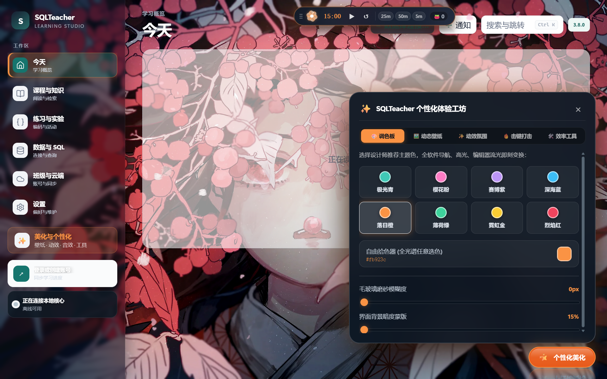
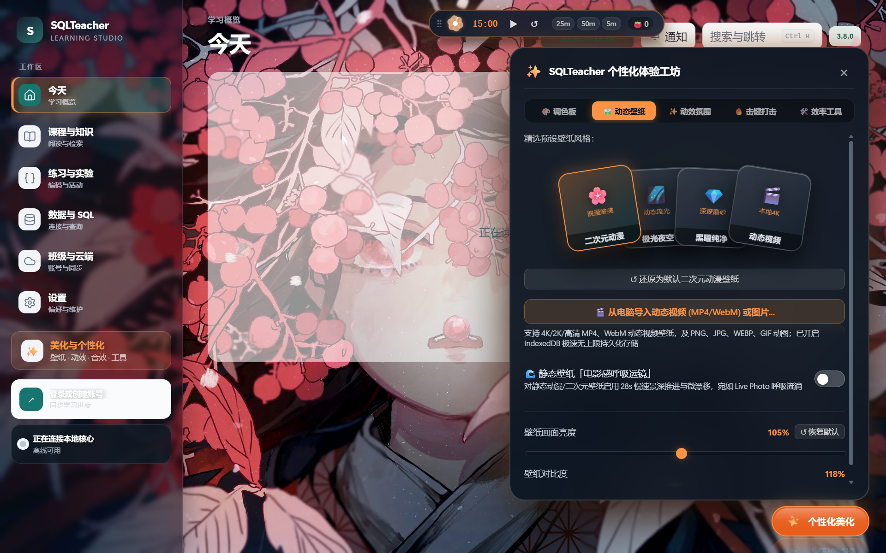
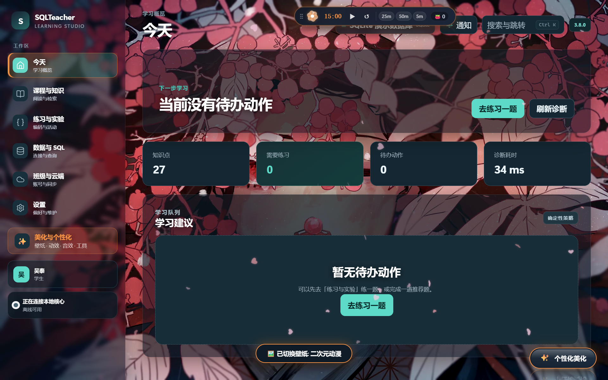
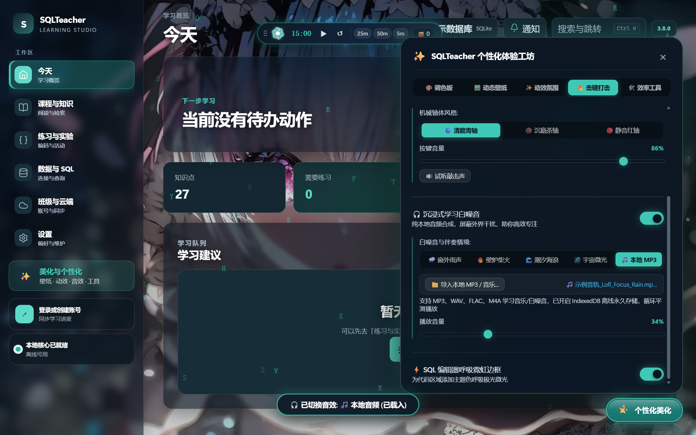
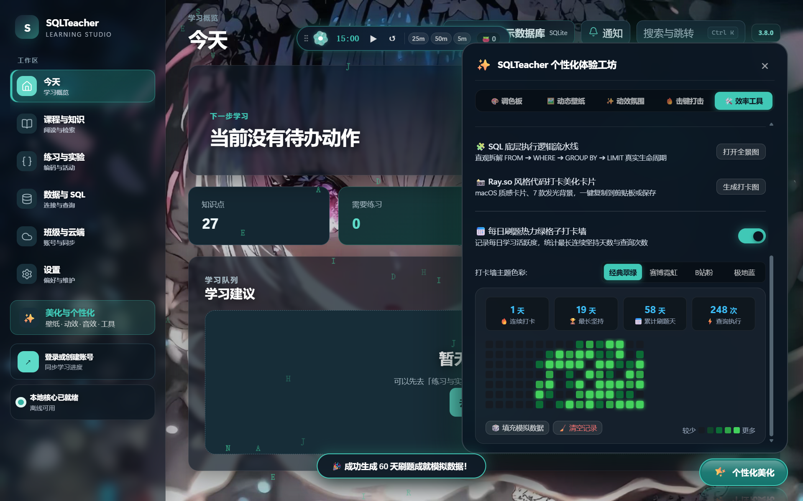

# 🌟 SQLTeacher-Enhance (SQLTeacher-Plus)

> **专为 [SQLTeacher (官方仓库: danlingdan/Teacher)](https://github.com/danlingdan/Teacher) 打造的豪华毛玻璃现代化 UI 与全沉浸式体验增强扩展包。**
> 纯本地运行、零侵入、零修改官方二进制、安全绿色、完全可逆。全面兼容官方 **v3.8.0** 最新版本。

[](https://opensource.org/licenses/MIT)
[](https://www.microsoft.com)
[](https://github.com/danlingdan/Teacher/releases/tag/v3.8.0)
[]()

---
---

## 📥 极速下载与安装 (Quick Download & Install)

用户与朋友无需配置任何开发环境，直接点击下方链接即可下载完整开箱即用安装包：

| 下载渠道 | 文件名 / 链接 | 适用场景 |
| :--- | :--- | :--- |
| 🚀 **GitHub Release 官方下载** | [**SQLTeacher-Enhance-v1.0.0.zip**](https://github.com/xxhhwtxx/SQLTeacher-Enhance/releases/download/v1.0.0/SQLTeacher-Enhance-v1.0.0.zip) | **推荐！** 包含独立引擎、样式与一键脚本（13.8MB） |
| 📦 **仓库内直链下载** | [**SQLTeacher-美化强化扩展包.zip**](https://github.com/xxhhwtxx/SQLTeacher-Enhance/raw/main/SQLTeacher-美化强化扩展包.zip) | 仓库源码同款打包版 |
| 🌐 **网页全量打包** | 点击页面右上角绿色按钮 **【Code】➔【Download ZIP】** | GitHub 官方自动生成的全量源码包 |

### 🎯 极速安装指引（只需 3 秒）：
1. 下载上述任意一个 .zip 压缩包并解压到电脑任意位置（如桌面）；
2. 双击运行解压后的 **一键安装美化版.bat**；
3. 安装向导会自动扫描识别您的 SQLTeacher，并在桌面上生成专属图标：
   👉 **【SQLTeacher (毛玻璃美化版)】**
4. 直接双击桌面图标即可畅享全新体验！

*若想恢复原版，双击运行解压包内的 **一键恢复原版.bat** 即可瞬间纯净复原，官方程序零篡改零损坏。*

---

## 📸 实机功能效果展示

### 1. 🎨 现代毛玻璃调色板 (Theme Palette)
* **8 款设计师预设主题**：极光青、樱花粉、赛博紫、深海蓝、落日橙、薄荷绿等；
* **自由色彩拾色器**：支持拾取 1677 万种任意 RGB 颜色，全应用微光实时变色；
* **视觉景深调节**：毛玻璃模糊度（0~40px）与背景暗度蒙版（15%~90%）连续平滑调节。



---

### 2. 🖼️ 3D 扇形动态壁纸画廊 (Dynamic Wallpaper Engine)
* **🎬 本地 4K 动态视频壁纸**：支持导入电脑中的 MP4 / WebM 高清视频，GPU 硬件加速低功耗静音循环播放；
* **🌊 静态壁纸电影感呼吸运镜 (Ken Burns Effect)**：为静态图片增添 28 秒平滑悠缓的推拉运镜呼吸感（类似 iOS 实况照片），让静态画面跃然屏上；
* **🃏 3D 扇形展开画廊**：多重卡牌倾角层叠，鼠标滑过时孔雀开屏般扇形展开；
* **🎛️ 独立画面明暗与对比度**：自由调节画面亮度（15%~200%）与对比度（50%~150%），确保代码文字始终清晰舒适；
* **💾 IndexedDB 离线持久化**：超大壁纸存入本地数据库，断网离线、关闭重启瞬间恢复。



---

### 3. ✨ 动效与氛围系统 & 生机繁花番茄钟
* **全屏动态粒子画布**：浪漫落樱、淅沥细雨、冰雪飞舞、矩阵代码雨 4 种环境粒子，支持密度与飘落速度调节；
* **夜空流星划过**：随机掠过一道绚丽流星；
* **鼠标跟随流星尾迹**：碎钻星尘、极光烟霞、梦幻气泡 3 种跟随流光；
* **🌸 生机灵动繁花番茄钟 (Blooming Botanical Pomodoro)**：
  - 顶部内嵌 6 瓣流光生机花瓣（Focus Flower Mandala），随心流旋转呼吸；
  - 专注倒计时结束瞬间触发繁花盛放璀璨庆祝动效（Grand Bloom Burst），今日专注计数 +1；
  - 支持 **25m 经典专注**、**50m 深度心流**、**5m 灵感短休** 模式快捷切换；
  - 按住胶囊前端 `⋮⋮` 可将番茄钟自由拖拽停靠至屏幕任意位置，坐标自动持久化记忆。



---

### 4. 🔥 击键打击感与专注音频引擎
* **Power Mode 击键连击系统**：耀眼火花、水晶碎片、飞花碎瓣、霓虹微粒 4 种爆破粒子，自带高频打字连击数徽章（COMBO!）与力反馈微震；
* **原生机械键盘音效**：清脆青轴、沉稳茶轴、静音红轴，基于 Web Audio 实时合成，带音量调节与试听；
* **🎵 沉浸式学习白噪音 & 本地 MP3 导入**：
  - 内置窗外雨声、温暖篝火、潮汐浪花、宇宙深空 4 款高质白噪音；
  - **支持导入电脑本地 MP3 / WAV / FLAC 音频**，采用 IndexedDB 离线永久安全存储（不挤占 LocalStorage 额度，永不爆配额），自动循环播放与平滑音量调节。



---

### 5. 🛠️ 效率神器与每日刷题热力绿格子打卡墙
* **🧩 SQL 底层执行逻辑流水线全景图**：
  - 在编辑器快捷栏点击【🧩 逻辑拆解】，一键可视化拆解当前 SQL 底层执行阶段：
    `FROM & JOIN ➔ WHERE ➔ GROUP BY ➔ HAVING ➔ SELECT ➔ DISTINCT ➔ ORDER BY ➔ LIMIT`
  - 自动高亮命中的阶段，点击节点可查看底层原理解析与避坑考点。
* **📸 Ray.so 风格代码打卡美化卡片生成器**：
  - 点击【📸 打卡图】，所见即所得生成 macOS 质感卡片、7 款发光渐变背景（极光霓虹、黑曜、日落等）；
  - 纯前端 Canvas 离线渲染，支持一键【复制图片】直接在微信/QQ中粘贴，或【保存为高清 PNG】。
* **📅 每日刷题热力绿格子打卡墙**：
  - 自动记录每日 SQL 查询与键盘编写活动；
  - 渲染 16 周热力方格矩阵，直观展示连续打卡天数（Streak）、最长坚持天数、累计执行次数；
  - 100% 还原**经典翠绿 4 级色阶**，并提供赛博霓虹、粉色、极地蓝等主题换肤。



---

## 🍏 交互设计亮点 (Apple Design Language)

1. **真实物理弹簧阻尼弹出 (Apple Spring Damping Physics)**：
   所有工坊弹窗、工具面板均采用高初速冲量、~2.5% 微过冲、弹性回弹与平滑阻尼收敛，告别生硬机械平移，内部元素错峰递进阶梯浮现。
2. **底面暗黑玻璃镜像反射 (-webkit-box-reflect)**：
   右下角悬浮胶囊采用真实的底面暗黑玻璃镜像倒影与弧面蓝宝石聚光倒角，悬停时文字翻滚过渡，渐变霓虹流光浮现。
3. **触觉物理微压缩 (Tactile Compression)**：
   界面所有按钮在按下瞬间具备真实物理触感微压缩反馈（`transform: scale(0.94)`）。

---

## 🚀 快速上手与安装指引

### 方法一：极简一键安装（推荐）

1. 下载本项目或 Releases 中的发布包。
2. 双击运行 **`一键安装美化版.bat`**。
3. 脚本会自动检测电脑中安装的 SQLTeacher 路径，并在桌面上生成专属快捷方式：
   👉 **【SQLTeacher (毛玻璃美化版)】**
4. 直接双击桌面图标即可开始体验！

### 如何彻底恢复原版？
* 双击运行 **`一键恢复原版.bat`**，即可一秒卸载增强扩展并移除快捷方式，官方原版未受任何修改，完全纯净可逆。

---

## 🏗️ 架构原理解析 (How it works)

```
┌─────────────────────────────────────────────────────────────┐
│                   SQLTeacher-Plus.exe                       │
│    (PyInstaller 编译的原生启动器，自动侦测安装路径与激活窗口)      │
└──────────────────────────────┬──────────────────────────────┘
                               │
       启动目标程序并指定调试通道 │ --remote-debugging-port=9222
                               ▼
┌─────────────────────────────────────────────────────────────┐
│              SQLTeacher (sqlteacher-desktop.exe)            │
│                  WebView2 / Tauri 运行时                    │
└──────────────────────────────┬──────────────────────────────┘
                               │
               Chrome DevTools Protocol (CDP) WebSocket
                               │
        ┌──────────────────────┴──────────────────────┐
        ▼                                             ▼
┌───────────────────────────────┐     ┌───────────────────────────────┐
│           theme.css           │     │    better-enhancements.js     │
│   (现代毛玻璃亚克力与动画样式)   │     │  (动效引擎 / 音频合成 / 工具链) │
└───────────────────────────────┘     └───────────────────────────────┘
```

1. **零篡改与非侵入性 (Non-invasive)**：
   启动器 `SQLTeacher-Plus.exe` 仅作为包装代理，通过 WebView2 原生开放的标准 Chrome DevTools Protocol 调试通道将 UI 样式与功能引擎热注入到前端页面中。**不修改官方可执行文件，不修改程序安装目录中的任何只读文件**。
2. **额度安全防护 (Quota-Safe Storage Architecture)**：
   WebView2 的 `localStorage` 具有严格的 5MB 配额限制。本项目将 4K 动态视频壁纸、高清图片与自定义 MP3 音乐等大体积媒体**严格隔离存放于 IndexedDB 浏览器专用数据库**（`BetterSQLTeacherAudioDB` 等），`localStorage` 仅保留小于 1KB 的轻量级纯文本配置，彻底根除配额溢出崩溃风险。

---

## 📂 仓库目录结构

```text
SQLTeacher-Enhance/
├── assets/                     # 高清实机功能预览截图
├── src/                        # 完整未混淆源代码
│   ├── better-enhancements.js  # 核心 JavaScript 增强引擎 (176KB)
│   ├── theme.css               # 核心 CSS 毛玻璃样式表 (531KB)
│   ├── launcher_bundle.py      # Python 启动器与 CDP 注入器源码
│   └── SQLTeacher-Plus.spec    # PyInstaller 编译规范文件
├── scripts/                    # 便捷脚本
│   ├── install.ps1             # PowerShell 自动安装与快捷方式生成器
│   └── uninstall.ps1           # PowerShell 卸载还原脚本
├── 一键安装美化版.bat            # 极简双击安装批处理
├── 一键恢复原版.bat             # 极简双击还原批处理
├── SQLTeacher-Plus.exe         # 预编译的原生独立可执行启动器 (开箱即用)
├── README.md                   # 项目使用与技术说明文档
└── LICENSE                     # MIT 开源许可证
```

---

## 🛠️ 从源码二次编译与打包

如果您想对启动器进行定制，可以使用 Python 3.10+ 和 PyInstaller 进行编译：

```bash
# 1. 安装所需依赖
pip install pyinstaller websockets pywin32

# 2. 编译生成单文件无控制台 EXE
pyinstaller src/SQLTeacher-Plus.spec
```

编译生成的可执行文件将位于 `dist/SQLTeacher-Plus.exe`。

---

## 🤝 致谢与开源协议

* **致敬原作**：本项目所有美化与增强特性均建立在优秀的开源项目 [danlingdan/Teacher (SQLTeacher)](https://github.com/danlingdan/Teacher) 基础之上。衷心感谢原作者的辛勤付出！
* **开源协议**：本项目基于 **[MIT License](LICENSE)** 开源，欢迎社区开发者自由交流、Fork、提交 PR 或提出 Issue 建议！
